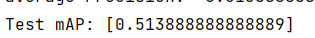

* We used a Potato dataset from the following dataset : https://data.mendeley.com/datasets/xn2wy75f8m/2
* however the images format does not work with the mask R-CNN architecture therefore we created the "generate_annot.py" file to create the annotations for each image in an xml format. We also created the target for each image by generating a senescence level from the RWC and NDVI values in the dataset. The results are saved in the "annots" file
* Here is an example of an annotation file for an image : 

* The mrcnn folder contains the modified architecture with a modified backbone with the added Dephwise Seperable Convolution layer to the Resnet architecture
* On the training of the initial model we got the following mean Average Precision for the validation set :

* The mrcnn_mobilenet folder contains the modified architecture with the mobilenet backbone
* in the mobilenet folder the model_init.py file contains an initial implementation where the mrcnn_class_loss always returns 0. 
* therefore we fixed it in the model.py file where we avoided this error 
* potato_config20240925T0503 represents the training of the final model however we noticed that from the validation phase of the first epoch the mrcnn losses always return 0 this is indicative that the model is overfitting 
* we created a conda environment based on mrcnn_kang.yml file to run our code into 
* The potato.py file represents the file for training and evaluation with the initial modified architecture
* The Potato_mobilenet.py file represents the file for training and evaluation with the mobilenet backbone.
* to train the model we need to set the train variable to True and to False for Evaluation
